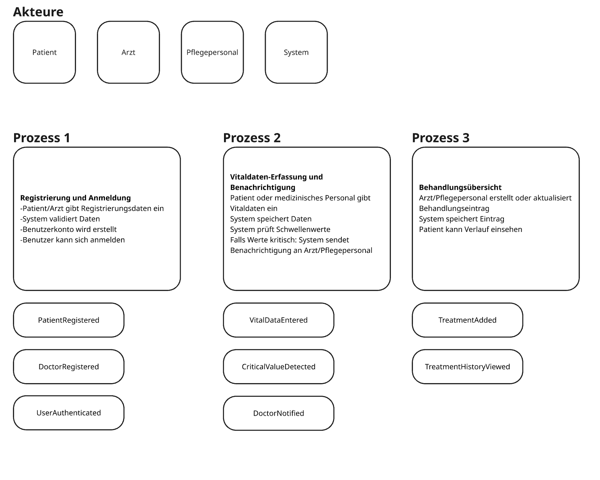
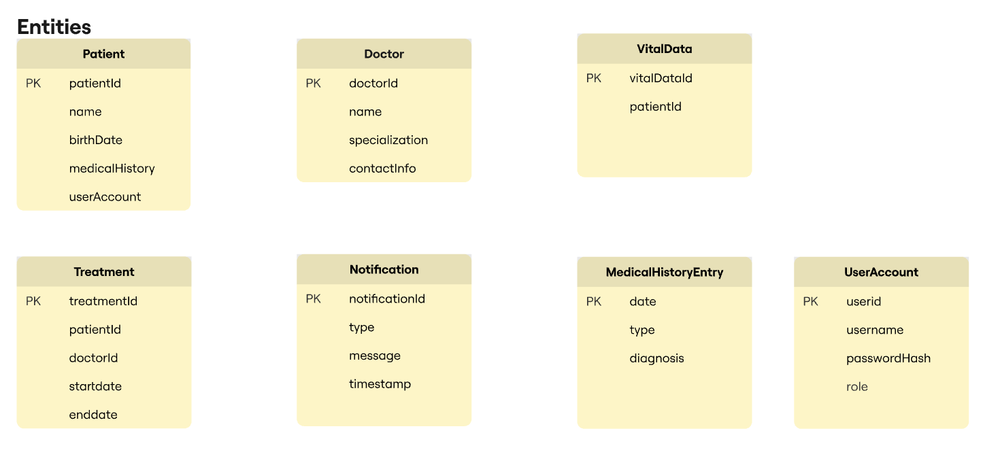
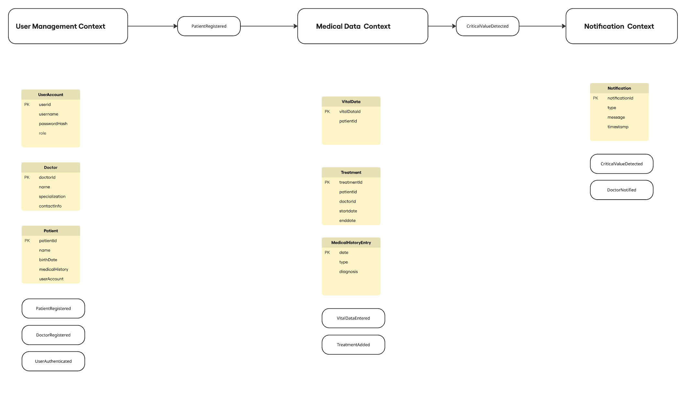
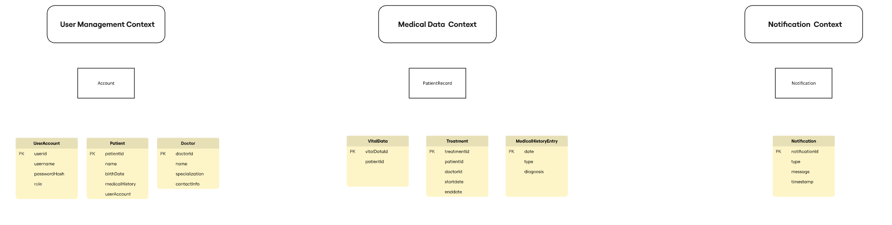
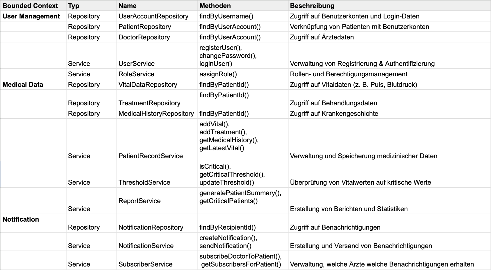

# 🧩 Aufgabe 3 – Domain-Driven Design (DDD)

## Schritt 1 – Event Storming

## Schritt 2 – Domänenmodell

## Schritt 3 – Bounded Contexts

## Schritt 4 – Entitäten und Aggregates

## Schritt 5 – Domain Services und Repositories
